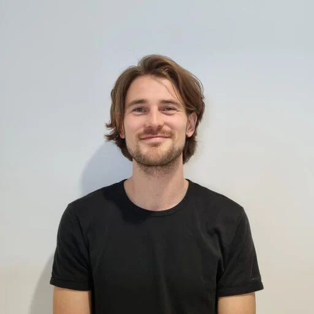
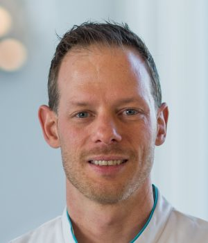

# ENIGMA-Tremor Core Team

Meet the people behind ENIGMA-Tremor!

<!-- 
The section below uses a special mix of markdown and HTML to make pretty cards.
To add another person, copy the following format and add it between the 
 
 tags:

COPY THIS TO ADD ANOTHER PERSON:

- { width="80" } **[Member One](https://personal.website.org/of-member-1)**  
  City University, The Country

 -->

- { width="80" } **[Member One](https://pure.amsterdamumc.nl/en/persons/max-laansma)**  
  Amsterdam UMC, The Netherlands

- { width="80" } **[Member One](https://www.amsterdamumc.org/en/research/researchers/arthur-buijink.htm)**  
  Amsterdam UMC, The Netherlands

- { width="80" } **[Member One](https://www.ru.nl/personen/helmich-r)**  
  Donders Institute Nijmegen, The Netherlands

- { width="80" } **[Paul Thompson](https://keck.usc.edu/faculty-search/paul-m-thompson/)**  
  University of Southern California, USA

- { width="80" } **[Neda Jahanshad](https://keck.usc.edu/faculty-search/neda-jahanshad/)**  
  University of Southern California, USA

